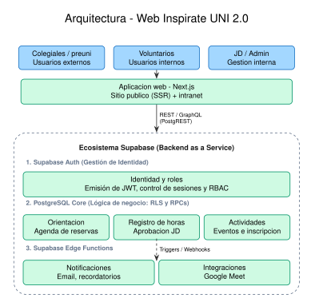

# Arquitectura y Decisiones Técnicas - Inspírate UNI

Este documento centraliza el diseño técnico de la plataforma y las razones detrás de nuestras decisiones estructurales. Nuestro objetivo es mantener un sistema de bajo costo, alta disponibilidad y fácil mantenimiento para la agrupación.

## 1. Visión General del Sistema

La plataforma consolida la presencia web pública, la gestión interna de voluntarios (Intranet) y el motor de Orientaciones Vocacionales (OVPGES).

## 2. Decisiones Arquitectónicas Clave

### El enfoque Backend-as-a-Service (BaaS)

Inicialmente evaluamos una arquitectura tradicional de tres capas (Next.js + NestJS + PostgreSQL). Sin embargo, mantener un servidor intermedio (NestJS) en capas gratuitas (como Render) introducía latencias inaceptables (*cold starts* de hasta un minuto tras inactividad).

Para garantizar una experiencia de usuario fluida, sin incurrir en costos de infraestructura para la agrupación, adoptamos una arquitectura de dos capas:

* **Cliente:** Next.js (App Router) encargado del SSR y las interacciones.
* **Backend:** Supabase, utilizando su API autogenerada (PostgREST) y gestionando toda la lógica de negocio, seguridad y validaciones directamente en PostgreSQL.

## 3. Modelo de Datos y Seguridad (RLS)

Al eliminar el backend intermedio, la seguridad recae en la base de datos. Utilizamos *Row Level Security* (RLS) de PostgreSQL para garantizar que los datos estén aislados por sesión.

**Reglas de acceso:**

* **Voluntarios:** Solo pueden realizar operaciones (SELECT/INSERT/UPDATE) sobre sus propios registros de horas y disponibilidad.
* **Público:** Las consultas públicas al módulo OVPGES se realizan a través de vistas seguras (`SECURE VIEWS`) que exponen únicamente los bloques horarios disponibles, anonimizando la identidad de los voluntarios.

## 4. Flujo del Módulo OVPGES

El sistema de Orientaciones Virtuales Personalizadas Grupales para Escolares requiere transaccionalidad estricta para evitar que dos escolares reserven el mismo horario.

1. El escolar selecciona un bloque disponible en el frontend.
2. Se invoca una función RPC (Remote Procedure Call) en Supabase.
3. La función ejecuta una transacción atómica: registra al escolar y cambia el estado del bloque a `booked`.
4. Un *Webhook* nativo de Supabase detecta el `INSERT` y dispara una *Edge Function*.
5. La *Edge Function* se comunica con la API de Google para generar el enlace de Google Meet y enviar las confirmaciones.

## 5. Estrategia de Envíos Masivos

Para las campañas de difusión (invitaciones a eventos), utilizamos Google Apps Scripts desplegado como una API interna. Esto nos permite sortear los límites diarios de envíos masivos (procesando los correos por tandas de hasta 1500) sin depender de servicios transaccionales de pago de terceros.

## 6. Infraestructura y Despliegue (DevOps)

Mantenemos la integridad del código mediante integraciones continuas. Las credenciales de producción son inyectadas exclusivamente como secretos en GitHub Actions.

* **Frontend:** Despliegues automatizados en Vercel.
* **Base de Datos:** Infraestructura como código. Toda alteración al esquema o a las políticas de seguridad se ejecuta estrictamente mediante archivos de migración declarativos (`supabase/migrations/`), probados automáticamente mediante `pgTAP` en nuestro pipeline antes de integrarse a la rama principal.
