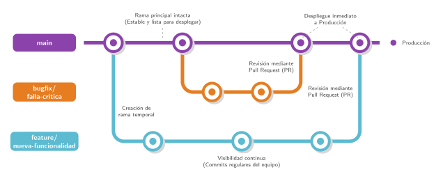

# Guía de Contribución - Inspírate UNI

¡Bienvenido al equipo! Este documento detalla el flujo de trabajo estricto que seguimos para mantener el repositorio de Inspírate UNI limpio, trazable y completamente automatizado. Operamos bajo un modelo centralizado; todos los desarrolladores colaboran directamente sobre este repositorio sin necesidad de crear *forks* personales.

## 1. Configuración Inicial (Bootstrapping)

Una vez que hayas aceptado la invitación como colaborador del repositorio, el primer paso es alistar tu entorno local para que cumpla con las reglas automatizadas del proyecto.

1. **Clona el repositorio:**

    ```bash
    git clone https://github.com/INSPIRATEUNI/inspirateuni-web.git
    cd inspirateuni-web
    ```

2. **Inicializa las herramientas locales:**
Ejecuta el siguiente comando en la raíz del proyecto:

    ```bash
    make init
    ```

> **Nota:** Este paso reconfigura la ruta de los *githooks* de tu máquina para apuntar a la carpeta `.githooks/` del proyecto. Esto activa los *scripts* `commit-msg` y `pre-commit` para ayudar al desarrollador a apegarse al conventional commits y a nuestras reglas de ramificación.

## 2. Creación de Ramas (GitHub Flow)


Nuestra fuente de verdad es la rama `main`. Nadie puede hacer *push* directo a esta línea. Todo desarrollo debe aislarse en ramas de corta vida.




* Crea tu rama siempre a partir de la versión más actualizada de `main`.
* Usa los prefijos **`feature/`** para características nuevas y **`bugfix/`** para solucionar errores.

    ```bash
    git checkout -b feature/nombre-descriptivo
    ```

## 3. Mensajes de Commit (Conventional Commits)

El proyecto impone la especificación de *Conventional Commits*. Si el formato es incorrecto, el *githook* abortará tu *commit* localmente.

* **Estructura base:** `tipo(alcance): describir brevemente`
* **Ejemplos aceptados:**
* `feat(auth): agregar validación al formulario de login`
* `fix(ovpges): corregir solapamiento en el calendario`
* `docs: actualizar el plan detallado y las decisiones arquitectónicas`

> **Nota:** Se recomienda usar siempre como primera palabra de la descripción breve del commit un verbo infinitivo (ej. añadir, corregir, actualizar, implementar, etc.).

## 4. Pull Requests y Revisión por Pares

Una vez finalizado el trabajo en tu rama local, debes integrarlo mediante un *Pull Request* (PR) dirigido a `main`.

1. **Sube tu rama:** `git push origin nombre-de-tu-rama`.
2. **Abre un PR en GitHub.**
3. **Cierre de Issue (Crítico):** Toda rama existe para resolver un problema documentado. En el cuerpo de la descripción de tu PR, **debes incluir** el comando de cierre referenciando el ID numérico de la tarea (ej. `Closes #15` o `Fixes #22`).
4. **Draft PR:** Si subes el código para respaldarlo o solicitar ayuda temprana, abre el PR como **Draft**.
5. **Peer Review:** Cuando el código esté terminado, cambia el PR a **Ready for review**. Es obligatorio contar con la aprobación de al menos un revisor del equipo para poder fusionar los cambios.

## 5. Automatización del Kanban

No actualices las columnas del tablero de GitHub Projects manualmente. La infraestructura reacciona a las etiquetas de cierre en tus PRs y mueve las *issues* por ti:

* **Backlog:** Estado natural de la *issue* recién creada.
* **In Progress:** La *issue* viaja aquí automáticamente en cuanto abres un PR en modo **Draft** que contiene la etiqueta `Closes #ID`.
* **In Review:** La *issue* avanza cuando marcas tu PR como definitivo (**Ready for review**).
* **Done:** La *issue* se cierra y se marca como completada cuando el equipo aprueba tu código y el PR se fusiona exitosamente en `main`.
