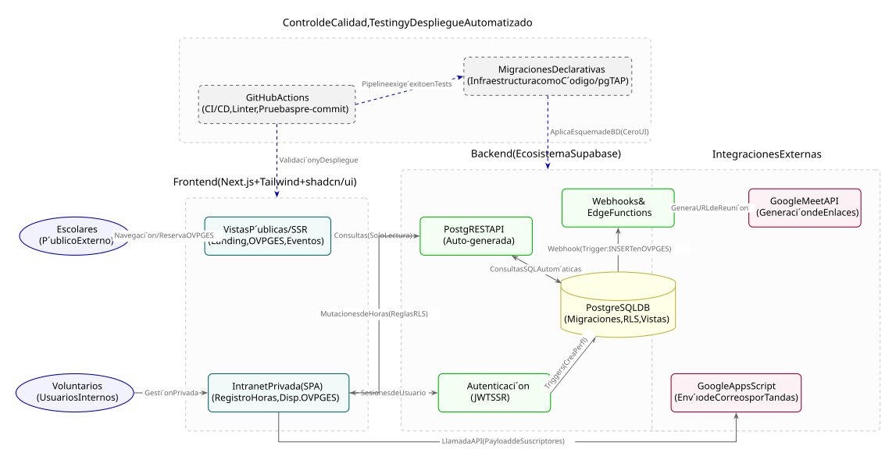
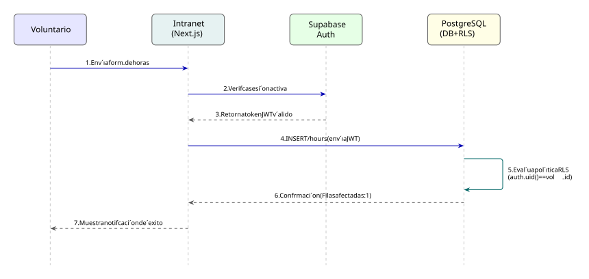
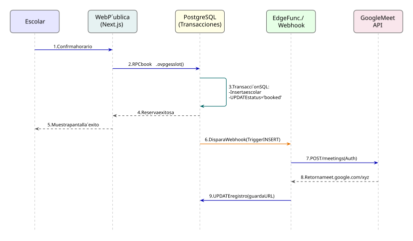

# Plan de Desarrollo - Web Inspírate UNI 2.0 (Next.js + Supabase)

## Panorama General de Sprints (Septiembre - Octubre 2026)

**Sprint 1: Cimentación DevOps, Presencia Web y MVP de Intranet (Semanas 1-2)**
Enfoque en la configuración rigurosa del entorno, CI/CD, migraciones declarativas y las dos prioridades principales: la presencia pública (eventos/programas) y el MVP de la intranet para el registro de horas de los voluntarios, permitiendo un ciclo de feedback temprano.

**Sprint 2: Desarrollo del Módulo OVPGES (Semanas 3-4)**
Construcción del sistema de Orientaciones Virtuales Personalizadas Grupales para Escolares (OVPGES). Creación de la interfaz privada para que los voluntarios registren su disponibilidad (estado aplanado, sin bucles anidados) y la interfaz pública separada por carreras.

**Sprint 3: Automatización, Integraciones y Webhooks (Semanas 5-6)**
Implementación del envío masivo de correos mediante Google Apps Scripts (por tandas) y configuración de Supabase Edge Functions / Webhooks para la automatización de enlaces de Google Meet tras cada registro en OVPGES.

**Sprint 4: Formularios Internos, QA Final y Lanzamiento (Semanas 7-8)**
Integración de formularios adicionales en la intranet, resolución del feedback de los voluntarios sobre el registro de horas, pruebas de extremo a extremo (E2E) y pase a producción para la segunda semana de octubre.

---

## Sprint 1: Cimentación, Presencia Web y MVP Intranet (Hiperdetallado)

*Duración: 2 Semanas | Roles Activos: DevOps, Backend (Supabase), Frontend (Next.js)*

Este sprint establece la fuente de la verdad, automatiza la calidad del código y despliega la base funcional requerida para la interacción inicial.

### Épica 1: Arquitectura, DevOps y Control de Calidad (Días 1-3)

El objetivo es establecer un flujo de trabajo donde la infraestructura como código (migraciones) y las pruebas automatizadas impidan la integración de código defectuoso.

**Issue 1.0: Bootstrapping y Estandarización del Repositorio**

- Rol: DevOps (Tech Lead)
- Configuración de githooks para forzar la nomenclatura de Conventional Commits.
- Implementación de workflows de GitHub Actions para el movimiento automático de tarjetas en el Kanban.
- Creación de un Makefile para estandarizar y acelerar la inicialización del entorno local de los colaboradores.
- Estructuración de directorios base con archivos .gitkeep.
- Configurar Branch Protection Rules en la rama main en GitHub para que toda PR pase las pruebas y revisión por pares.
- Documentación inicial del repositorio (README, reglas de contribución).

**Issue 1.1: Inicialización del Monorepo y Ecosistema Frontend**

- Crear proyecto Next.js (App Router) con TypeScript.
- Configurar Tailwind CSS de forma estricta (deshabilitar colores innecesarios, definir paleta de la agrupación).
- Integrar `shadcn/ui` o componentes base accesibles para evitar la fragmentación de estilos (cero dependencias a Bootstrap o MUI).
- Configurar alias absolutos (ej. `@/components`, `@/lib`).

**Issue 1.2: Configuración de la Fuente de Verdad Declarativa (Base de Datos)**

- Inicializar Supabase CLI localmente (`supabase init`).
- Establecer que **todas** las modificaciones a la base de datos deben realizarse mediante archivos SQL en `supabase/migrations/` (prohibido usar la UI web de Supabase para alterar esquemas en producción).
- Crear el archivo `0000_initial_schema.sql` definiendo los esquemas básicos (`public`, extensiones necesarias).

**Issue 1.3: Automatización de Pruebas en Entorno Local (Pre-commit)**

- Configurar Husky y lint-staged.
- Frontend: Reglas de ESLint, Prettier y chequeo de tipos estáticos (`tsc --noEmit`) en archivos modificados antes de cada commit.
- Backend/DB: Script local que levante contenedores de Supabase (`supabase start`) y ejecute pruebas unitarias SQL (pgTAP) en local antes de permitir un push a las ramas principales.

**Issue 1.4: CI/CD Pipelines en GitHub Actions**

- Crear `.github/workflows/ci.yml` que se dispare en PRs hacia `main` o `develop`.
- Job 1 (Frontend): Instalar dependencias, ejecutar linter, build de Next.js (pruebas de compilación).
- Job 2 (Backend): Instalar Supabase CLI, arrancar instancia efímera de DB, aplicar migraciones y ejecutar tests pgTAP. El PR debe bloquearse si algún job falla.

### Épica 2: Base de Datos y Autenticación Backend (Días 4-6)

Construcción segura y escalable del modelo de datos para la Intranet, gestionado declarativamente.

**Issue 2.1: Migración Declarativa - Tabla de Usuarios y Perfiles**

- Crear migración `0001_create_profiles.sql`.
- Vincular mediante triggers la tabla nativa `auth.users` de Supabase con una tabla pública `profiles` (id, rol, nombre completo, carrera).
- Implementar función SQL (Trigger) que inserte un registro en `profiles` automáticamente al registrarse un usuario en `auth`.

**Issue 2.2: Migración Declarativa - Tablas de Registro de Horas**

- Crear migración `0002_volunteer_hours.sql`.
- Crear tabla `extracurricular_hours` (id, volunteer_id, event_name, hours_logged, date, status [pending, approved, rejected], notes).
- Definir claves foráneas estrictas y restricciones (ej. hours_logged > 0).

**Issue 2.3: Implementación de Políticas de Seguridad (RLS)**

- Crear migración `0003_rls_policies.sql`.
- Habilitar Row Level Security en `profiles` y `extracurricular_hours`.
- Política 1: Un voluntario solo puede hacer SELECT/INSERT de sus propios registros en `extracurricular_hours` (`auth.uid() = volunteer_id`).
- Política 2: Solo administradores (definido vía custom claims o tabla de roles) pueden hacer UPDATE al status de las horas.

**Issue 2.4: Pruebas Unitarias de Base de Datos (pgTAP)**

- Escribir scripts de test en `supabase/tests/database/`.
- Testear que el trigger de creación de perfiles funciona.
- Testear que un usuario no autenticado no puede leer horas.
- Testear que un usuario X no puede leer las horas del usuario Y.

### Épica 3: Desarrollo Frontend - Vistas Públicas DRY (Días 7-10)

Desarrollo de las interfaces públicas aplicando principios de no repetición (DRY) aprendidos del código heredado.

**Issue 3.1: Layout Global y Componentes Core**

- Desarrollar `<Header />` y `<Footer />` responsivos usando Tailwind.
- Implementar el enrutador principal en el `layout.tsx` raíz.
- Construir sistema de tipografía y botones globales para mantener consistencia.

**Issue 3.2: Componente Dinámico de Galería (Abstracción DRY)**

- Crear un componente reutilizable `<GalleryTemplate data={...} />` para renderizar eventos y programas.
- Integrar Framer Motion para las transiciones modales, asegurando que el componente acepte contenido agnóstico (imágenes, descripciones, fechas) por props.
- Eliminar la necesidad de crear archivos de vistas idénticos para cada tipo de evento.

**Issue 3.3: Integración de la Página de Inicio y Eventos**

- Maquetar la landing page pública (ruta `/`).
- Implementar el carrusel de bienvenida (optimizado para SSR y carga de imágenes con `next/image`).
- Consumir datos estáticos (o desde Supabase) para poblar el `<GalleryTemplate />` en la ruta `/eventos`.

### Épica 4: Desarrollo Frontend - MVP Intranet y Registro de Horas (Días 11-14)

Construcción del sistema cerrado para voluntarios y conexión con la base de datos segura.

**Issue 4.1: Flujo de Autenticación (Supabase SSR)**

- Instalar y configurar `@supabase/ssr` para Next.js.
- Crear vista de Login (`/login`) y manejar la creación de sesiones mediante JWT.
- Configurar un Middleware en Next.js (`middleware.ts`) para proteger las rutas bajo `/intranet/*`. Si no hay sesión, redirigir al login.

**Issue 4.2: Dashboard de la Intranet y Contexto Global**

- Crear el Layout de la intranet con una barra de navegación lateral.
- Implementar obtención de datos del usuario logueado en el servidor (Server Component) para mostrar un saludo y su rol.

**Issue 4.3: Formulario de Registro de Horas (Cliente a Base de Datos)**

- Crear interfaz del formulario en `/intranet/horas/registrar`.
- Usar React Hook Form y Zod para validación del lado del cliente (nombre del evento, cantidad de horas, fecha).
- Conectar el formulario a la base de datos ejecutando inserciones autenticadas hacia la tabla `extracurricular_hours`.

**Issue 4.4: Tabla de Visualización de Horas Personales**

- Crear vista `/intranet/horas/historial`.
- Realizar consulta Server-Side a Supabase para obtener el historial del voluntario (gracias a RLS, la consulta es `select * from extracurricular_hours` y la DB filtra automáticamente).
- Mostrar los datos en una tabla estilizada con Tailwind, indicando el estado (Pendiente/Aprobado) con colores (Badges).
- Añadir cálculo automático del total de horas aprobadas acumuladas en la interfaz.

## Sprint 2: Desarrollo del Módulo OVPGES (Hiperdetallado)

*Duración: Semanas 3-4 | Roles Activos: Frontend (Next.js), Backend (Supabase)*

Este sprint se centra en el módulo OVPGES (Orientaciones Virtuales Personalizadas Grupales para Escolares). Se construirá tanto el formulario privado para la disponibilidad de los voluntarios como el listado público de carreras.

### Épica 1: Base de Datos y Esquema Relacional de OVPGES (Días 1-4)

**Issue 2.1: Migración Declarativa - Catálogo de Facultades y Carreras**

- Crear migración `0004_faculties_and_careers.sql`.
- Definir tablas `faculties` (id, nombre) y `careers` (id, faculty_id, nombre).
- Insertar los datos estáticos de la universidad mediante un script SQL inicial para ser consumidos por el cliente.

**Issue 2.2: Migración Declarativa - Disponibilidad de Voluntarios**

- Crear migración `0005_volunteer_availability.sql`.
- Crear tabla `volunteer_availability` (id, volunteer_id, career_id, date, start_time, end_time, status [available, booked]).
- Habilitar RLS: Los voluntarios solo pueden insertar/editar sus propios registros de disponibilidad (`auth.uid() = volunteer_id`) garantizando acceso restringido.

**Issue 2.3: Vista SQL (View) para Disponibilidad Pública**

- Crear migración `0006_public_availability_view.sql`.
- Diseñar la estructura SQL que cruza a los voluntarios con las carreras disponibles para exponer un horario general público.
- Crear una vista segura (`SECURE VIEW`) que agrupe los rangos horarios por carrera y exponga solo los bloques con estado `available`, ocultando la identidad interna del voluntario.

### Épica 2: Frontend Intranet - Registro de Disponibilidad (Días 5-8)

**Issue 2.4: Formulario Privado de Disponibilidad (Estado Aplanado)**

- Construir la vista protegida `/intranet/ovpges/disponibilidad` donde los voluntarios registran su disponibilidad separados por carrera.
- Implementar un estado de React aplanado (ej. `const [carreraActiva, setCarreraActiva] = useState(null)`) para gestionar las selecciones sin mutar arreglos anidados.
- El renderizado de los *checkboxes* de disponibilidad se ejecuta en tiempo lineal, eliminando la complejidad $O(n^2)$ del enfoque anterior.

**Issue 2.5: Integración Estandarizada del Calendario**

- Utilizar una única librería (ej. `react-calendar`) en el formulario de la intranet para la selección de fechas.
- Excluir cualquier componente manual de calendario o generación de grillas matriciales que cause código muerto.
- Conectar el formulario para ejecutar inserciones directas a la tabla `volunteer_availability` mediante el cliente de Supabase.

### Épica 3: Frontend Público - Explorador de Carreras y Horarios (Días 9-11)

**Issue 2.6: Interfaz Pública del Módulo OVPGES**

- Crear la ruta `/ovpges` para que los usuarios externos vean la disponibilidad general agrupada.
- Consumir la vista SQL (Issue 2.3) mediante consultas PostgREST para renderizar dinámicamente los rangos horarios disponibles por carrera.

**Issue 2.7: Interacción y Selección Dinámica de Horarios**

- Implementar validaciones dinámicas en el calendario público (`react-calendar`), deshabilitando fechas (ej. `tileDisabled`) dependiendo de la carrera seleccionada por el escolar.
- Añadir el componente `<GalleryTemplate />` o tarjetas estilizadas con Tailwind para la navegación fluida entre facultades y carreras.

### Épica 4: Flujo de Inscripción Escolar (Días 12-14)

**Issue 2.8: Captura de Datos y Transaccionalidad**

- Desarrollar un modal animado (Framer Motion) para capturar el nombre y correo del escolar antes de confirmar el registro.
- Crear la tabla `ovpges_registrations` en Supabase.
- Implementar una función RPC (`0007_book_ovpges_slot.sql`) que inserte el registro del escolar y actualice el estado del horario a `booked` en una sola transacción SQL segura, evitando sobreescrituras (race conditions).

## Sprint 3: Automatización, Integraciones y Webhooks (Semanas 5-6)

*Duración: Semanas 5-6 | Roles Activos: Integraciones, Backend (Supabase), Frontend (Next.js)*

Este sprint aborda la automatización de los flujos de comunicación y reuniones, reemplazando tareas manuales por integraciones programáticas, y comienza el ciclo iterativo de mejoras basadas en el uso real de la plataforma.

### Épica 1: Generación Automática de Enlaces (Días 1-5)

**Issue 3.1: Configuración de Webhooks en Base de Datos**

- Configurar *webhooks* nativos vinculados a la base de datos en Supabase.
- Establecer un *trigger* para que el *webhook* se dispare exclusivamente ante eventos de tipo `INSERT` en la tabla de inscripciones del módulo OVPGES.

**Issue 3.2: Edge Functions para Google Meet**

- Programar *Edge Functions* en Supabase para recibir el *payload* del registro escolar.
- Vincular la función con la API de Google para automatizar la generación de enlaces de Google Meet para las orientaciones al confirmar una inscripción.
- Configurar la función para que actualice el registro en la base de datos con la URL de la reunión y dispare la notificación correspondiente.

### Épica 2: Sistema de Correos Masivos (Días 6-9)

**Issue 3.3: Adaptación de Google Apps Script**

- Rescatar y adaptar el *script* heredado en Google Apps Scripts utilizado en años anteriores para el Open Day.
- Programar la lógica para que el envío masivo de correos de invitación a eventos se realice obligatoriamente por tandas.
- Establecer un límite máximo en el código (1500 diarios) para respetar las cuotas del servicio y evitar bloqueos por *spam*.
- Desplegar el *script* como una API, dejándolo listo para recibir un *payload* básico con la lista de suscriptores.

**Issue 3.4: Disparador Frontend de Campañas de Correo**

- Construir una interfaz administrativa oculta en la intranet para invocar la API de envíos masivos.
- Activar el envío masivo de correos de invitación para los usuarios externos que demostraron interés en los eventos públicos.

### Épica 3: Feedback y Formularios Adicionales (Días 10-14)

**Issue 3.5: Análisis de UX en Registro de Horas**

- Recopilar retroalimentación temprana de los voluntarios sobre el uso cotidiano de la intranet.
- Evaluar las fricciones del sistema de registro de horas extracurriculares (validar si la interfaz resulta muy pesada para el uso diario) y documentar los ajustes necesarios.

**Issue 3.6: Integración de Formularios Internos**

- Desarrollar un apartado o componente genérico dentro de la intranet capaz de invocar o incrustar formularios de manera dinámica.
- Integrar estos formularios adicionales en la intranet para uso exclusivo de los voluntarios (ej. encuestas internas o propuestas de eventos).

## Sprint 4: Formularios Internos, QA Final y Lanzamiento (Hiperdetallado)

*Duración: Semanas 7-8 (Hasta la segunda semana de octubre) | Roles Activos: Todo el equipo*

Este sprint aborda las prioridades finales, aplica las mejoras sugeridas en el ciclo de pruebas interno y estabiliza el código para cumplir con la meta de lanzamiento pactada para octubre.

### Épica 1: Refinamiento de UX y Resolución de Feedback (Días 1-4)

**Issue 4.1: Refactorización de la UI de Registro de Horas**

- Aplicar las mejoras sugeridas por los voluntarios durante sus pruebas tempranas del sistema de registro de horas en la intranet.
- Simplificar la interacción del formulario y la visualización de datos si el *feedback* indicó que la implementación resultó muy pesada en la práctica.

**Issue 4.2: Auditoría del Ecosistema de Estilos**

- Verificar que el *bundle* de producción no incluya dependencias duplicadas o fragmentadas de la web heredada, como Bootstrap puro o Material UI.
- Confirmar que todas las vistas públicas (eventos y programas) utilicen correctamente el renderizado en el servidor (SSR) en Next.js para asegurar la carga rápida y el SEO.

### Épica 2: Finalización de Formularios Internos (Días 5-7)

**Issue 4.3: Construcción de Formularios para Voluntarios**

- Abordar el último requerimiento de la lista de prioridades creando los formularios internos específicos para los voluntarios dentro de la intranet.
- Crear las migraciones declarativas SQL para almacenar estas respuestas, aplicando políticas de seguridad (RLS) para que la información esté estrictamente ligada a la sesión y rol de cada voluntario.

### Épica 3: Calidad y Pruebas End-to-End (Días 8-11)

**Issue 4.4: Pruebas E2E del Flujo OVPGES**

- Automatizar el flujo completo de un escolar seleccionando una carrera en el frontend, enviando el formulario, y verificando que el backend actualice el estado a ocupado.
- Comprobar que la vista pública de carreras refleje la disponibilidad sin mostrar datos privados de los miembros.

**Issue 4.5: Auditoría de Seguridad de Sesiones**

- Validar mediante *scripts* y pruebas manuales la gestión de identidad mediante JWT, garantizando la redirección automática al inicio cuando un voluntario intenta acceder a rutas protegidas sin credenciales válidas.

### Épica 4: Despliegue en Producción y Monitoreo (Días 12-14)

**Issue 4.6: Pipelines Finales y Migración a Producción**

- Supervisar el entorno de producción para garantizar que los *pipelines* de GitHub Actions ejecuten el *linting* y bloqueen cualquier error antes del despliegue final.
- Ejecutar la fuente de la verdad declarativa de Supabase (todas las migraciones SQL acumuladas) en el entorno de producción.

**Issue 4.7: Lanzamiento y Entrega Oficial**

- Desplegar la versión final de la plataforma, asegurando que la presencia web principal esté 100% operativa.
- Confirmar a Imagen Institucional que la página web está funcionando y lista para el público antes de la segunda semana de octubre.
