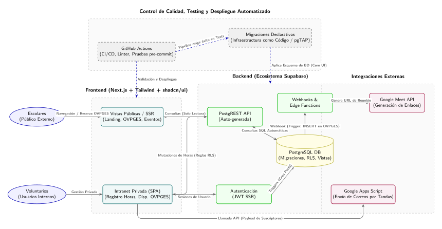
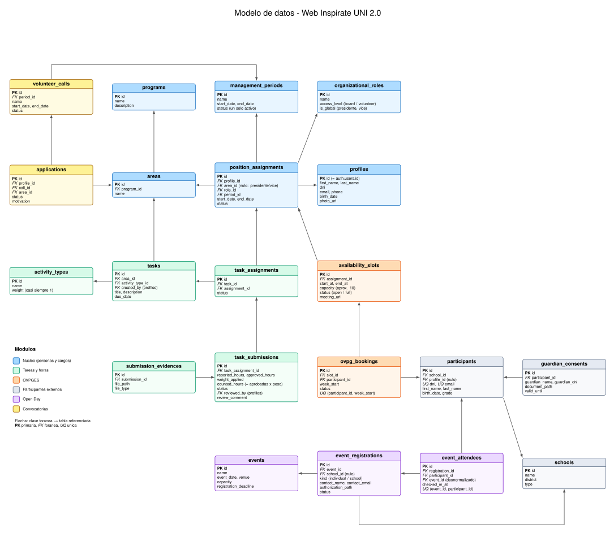
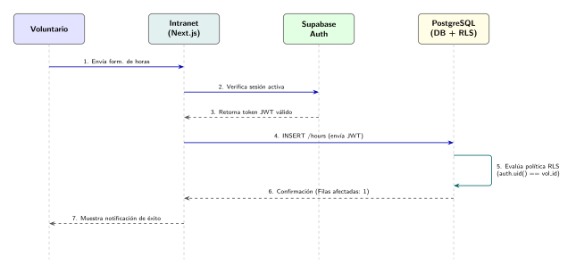
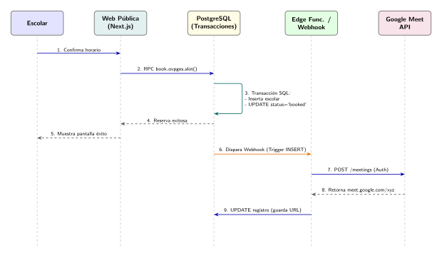

# Plan de Desarrollo - Web Inspírate UNI 2.0 (Next.js + Supabase)

## Panorama General de Sprints (Septiembre - Octubre 2026)

**Sprint 1: Cimentación DevOps, Presencia Web y MVP de Intranet (Semanas 1-2)**
Enfoque en la configuración rigurosa del entorno, CI/CD, migraciones declarativas y las dos prioridades principales: la presencia pública (eventos/programas) y el MVP de la intranet de tareas y horas (los directores asignan tareas, los voluntarios reportan tiempo con evidencia y los directores aprueban o rechazan), permitiendo un ciclo de feedback temprano. Incluye el núcleo organizacional del modelo de datos ([DATABASE.md](./DATABASE.md)).

**Sprint 2: Desarrollo del Módulo OVPGES (Semanas 3-4)**
Construcción del sistema de Orientaciones Virtuales Personalizadas Grupales para Escolares (OVPGES). Creación de la interfaz privada para que los voluntarios registren su disponibilidad (estado aplanado, sin bucles anidados) y la interfaz pública separada por carreras, con inscripción grupal (cupo de aprox. 10), verificación OTP, límite de una reserva por semana y autorización para menores.

**Sprint 3: Automatización, Integraciones, Webhooks y Open Day (Semanas 5-6)**
Implementación del envío masivo de correos mediante Google Apps Scripts (por tandas), configuración de Supabase Edge Functions / Webhooks para el enlace de Google Meet de cada bloque OVPGES, y la inscripción al Open Day (personas libres y colegios con lista de alumnos).

**Sprint 4: Formularios Internos, QA Final y Lanzamiento (Semanas 7-8)**
Integración de formularios adicionales en la intranet, resolución del feedback de los voluntarios sobre el registro de horas, pruebas de extremo a extremo (E2E) y pase a producción para la segunda semana de octubre.

**Fuera del alcance del lanzamiento (backlog):** convocatorias de voluntarios (`volunteer_calls` y `applications`). Están diseñadas en [DATABASE.md](./DATABASE.md) pero se implementarán después del pase a producción.

---

## Sprint 1: Cimentación, Presencia Web y MVP Intranet (Hiperdetallado)

*Duración: 2 Semanas | Roles Activos: DevOps, Backend (Supabase), Frontend (Next.js)*

Este sprint establece la fuente de la verdad, automatiza la calidad del código y despliega la base funcional requerida para la interacción inicial.

### Épica 1: Arquitectura, DevOps y Control de Calidad (Días 1-3)

El objetivo es establecer un flujo de trabajo donde la infraestructura como código (migraciones) y las pruebas automatizadas impidan la integración de código defectuoso.

**Issue 1.1.0: Bootstrapping y Estandarización del Repositorio**

- **Rol: DevOps (Tech Lead)**
- Configuración de githooks para forzar la nomenclatura de Conventional Commits y la ramificación según GitHub Flow.
- Implementación de workflows de GitHub Actions para el movimiento automático de tarjetas en el Kanban.
- Creación de un Makefile para estandarizar y acelerar la inicialización del entorno local de los colaboradores.
- Estructuración de directorios base con archivos .gitkeep.
- Configurar Branch Protection Rules en la rama main en GitHub para que toda PR pase las pruebas y revisión por pares.
- Documentación inicial del repositorio (README, reglas de contribución).

**Issue 1.1.1: Inicialización del Monorepo y Ecosistema Frontend**

- **Rol: DevOps / Frontend**
- Crear proyecto Next.js (App Router) con TypeScript.
- Configurar Tailwind CSS de forma estricta (deshabilitar colores innecesarios, definir paleta de la agrupación).
- Integrar `shadcn/ui` o componentes base accesibles para evitar la fragmentación de estilos (cero dependencias a Bootstrap o MUI).
- Configurar alias absolutos (ej. `@/components`, `@/lib`).

**Issue 1.1.2: Configuración de la Fuente de Verdad Declarativa (Base de Datos)**

- **Rol: DevOps / Backend**
- Inicializar Supabase CLI localmente (`supabase init`).
- Establecer que **todas** las modificaciones a la base de datos deben realizarse mediante archivos SQL en `supabase/migrations/` (prohibido usar la UI web de Supabase para alterar esquemas en producción).
- Crear el archivo `0000_initial_schema.sql` definiendo los esquemas básicos (`public`, extensiones necesarias).

**Issue 1.1.3: Automatización de Pruebas en Entorno Local (Pre-commit)**

- **Rol: DevOps**
- Configurar Husky y lint-staged.
- Frontend: Reglas de ESLint, Prettier y chequeo de tipos estáticos (`tsc --noEmit`) en archivos modificados antes de cada commit.
- Backend/DB: Script local que levante contenedores de Supabase (`supabase start`) y ejecute pruebas unitarias SQL (pgTAP) en local antes de permitir un push a las ramas principales.

**Issue 1.1.4: CI/CD Pipelines en GitHub Actions**

- **Rol: DevOps**
- Crear `.github/workflows/ci.yml` que se dispare en PRs hacia `main` o `develop`.
- Job 1 (Frontend): Instalar dependencias, ejecutar linter, build de Next.js (pruebas de compilación).
- Job 2 (Backend): Instalar Supabase CLI, arrancar instancia efímera de DB, aplicar migraciones y ejecutar tests pgTAP. El PR debe bloquearse si algún job falla.

### Épica 2: Base de Datos y Autenticación Backend (Días 4-6)

Construcción segura y escalable del modelo de datos para la Intranet, gestionado declarativamente. El diseño completo está en [DATABASE.md](./DATABASE.md). Cada issue edita archivos numerados en `backend/supabase/schemas/` y genera la migración con `npx supabase db schema declarative sync --name <nombre> --no-apply`.

**Issue 1.2.1: Schema - Perfiles**

- **Rol: Backend**
- Editar `schemas/01_profiles.sql`.
- Crear `profiles` con `id` referenciando `auth.users.id` (sin contraseña propia), nombres, `dni`, `email`, `phone`, `birth_date` y `photo_url`.
- Implementar función SQL (Trigger) que inserte un registro en `profiles` automáticamente al registrarse un usuario en `auth`.

**Issue 1.2.2: Schema - Núcleo organizacional**

- **Rol: Backend**
- Crear `schemas/02_organization.sql`.
- Tablas: `programs`, `areas`, `management_periods`, `organizational_roles` y `position_assignments`.
- `organizational_roles` incluye `access_level` (`board` / `volunteer`) e `is_global` (true para presidente y vice). `position_assignments.area_id` admite NULL (presidente y vice no pertenecen a un área).
- Índice único parcial para que solo exista un `management_periods` activo.
- Estados como enums de Postgres.

**Issue 1.2.3: Schema - Tareas y horas extracurriculares**

- **Rol: Backend**
- Crear `schemas/03_tasks_hours.sql`.
- Tablas: `activity_types` (con `weight`), `tasks`, `task_assignments`, `task_submissions` y `submission_evidences`.
- `task_submissions` guarda `reported_hours`, `approved_hours`, `weight_applied` y `counted_hours` (columna generada: `approved_hours × weight_applied`), con flujo `assigned → submitted → approved | rejected`, `reviewed_by` y `reviewed_at`.
- Crear la vista `extracurricular_hours` que suma `counted_hours` de las entregas aprobadas por voluntario y período. Es una vista, no una tabla.
- Restricciones (ej. horas > 0) y bucket de Storage para las evidencias.

**Issue 1.2.4: Implementación de Políticas de Seguridad (RLS)**

- **Rol: Backend**
- Crear `schemas/04_rls_core.sql`.
- Función `is_board()` / `is_global()` basada en la asignación activa del usuario.
- Habilitar RLS en las tablas del núcleo y de tareas.
- Política 1: un voluntario solo ve sus propias asignaciones y entregas, y solo puede insertar o actualizar entregas propias mientras no estén aprobadas.
- Política 2: un director crea, ve y revisa tareas únicamente de su área. Presidente y vice (`is_global`) lo hacen en todas las áreas.
- Política 3: solo un director con permiso sobre el área puede cambiar el `status` de una entrega y fijar `approved_hours`.

**Issue 1.2.5: Pruebas Unitarias de Base de Datos (pgTAP)**

- **Rol: Backend**
- Escribir scripts de test en `supabase/tests/database/`.
- Testear que el trigger de creación de perfiles funciona.
- Testear que un usuario no autenticado no puede leer horas.
- Testear que un voluntario X no puede leer las entregas del voluntario Y.
- Testear que un director no puede revisar entregas de otra área, y que presidente y vice sí.
- Testear que `counted_hours` aplica el peso correctamente.

### Épica 3: Desarrollo Frontend - Vistas Públicas DRY (Días 7-10)

Desarrollo de las interfaces públicas aplicando principios de no repetición (DRY) aprendidos del código heredado.

**Issue 1.3.1: Layout Global y Componentes Core**

- **Rol: Frontend**
- Desarrollar `<Header />` y `<Footer />` responsivos usando Tailwind.
- Implementar el enrutador principal en el `layout.tsx` raíz.
- Construir sistema de tipografía y botones globales para mantener consistencia.

**Issue 1.3.2: Componente Dinámico de Galería (Abstracción DRY)**

- **Rol: Frontend**
- Crear un componente reutilizable `<GalleryTemplate data={...} />` para renderizar eventos y programas.
- Integrar Framer Motion para las transiciones modales, asegurando que el componente acepte contenido agnóstico (imágenes, descripciones, fechas) por props.
- Eliminar la necesidad de crear archivos de vistas idénticos para cada tipo de evento.

**Issue 1.3.3: Integración de la Página de Inicio y Eventos**

- **Rol: Frontend**
- Maquetar la landing page pública (ruta `/`).
- Implementar el carrusel de bienvenida (optimizado para SSR y carga de imágenes con `next/image`).
- Consumir datos estáticos (o desde Supabase) para poblar el `<GalleryTemplate />` en la ruta `/eventos`.

### Épica 4: Desarrollo Frontend - MVP Intranet, Tareas y Horas (Días 11-14)

Construcción del sistema cerrado para la Junta Directiva y los voluntarios, y conexión con la base de datos segura. Los directores asignan tareas, los voluntarios reportan el tiempo con evidencia y los directores aprueban o rechazan.

**Issue 1.4.1: Flujo de Autenticación (Supabase SSR)**

- **Rol: Frontend**
- Instalar y configurar `@supabase/ssr` para Next.js.
- Crear vista de Login (`/login`) y manejar la creación de sesiones mediante JWT.
- Configurar un Middleware en Next.js (`middleware.ts`) para proteger las rutas bajo `/intranet/*`. Si no hay sesión, redirigir al login.

**Issue 1.4.2: Dashboard de la Intranet y Contexto Global**

- **Rol: Frontend**
- Crear el Layout de la intranet con una barra de navegación lateral.
- Implementar obtención de datos del usuario logueado en el servidor (Server Component) para mostrar un saludo y su rol.

**Issue 1.4.3: Asignación de Tareas (Directores)**

- **Rol: Frontend**
- Crear `/intranet/tareas/nueva` visible solo para la Junta Directiva.
- Formulario con título, descripción, tipo de actividad, fecha límite y voluntarios asignados. Un director solo elige su propia área; presidente y vice pueden elegir cualquier área (la restricción real la aplica RLS).
- Usar React Hook Form y Zod, e insertar en `tasks` y `task_assignments`.

**Issue 1.4.4: Reporte de Horas con Evidencia (Voluntarios)**

- **Rol: Frontend**
- Crear `/intranet/tareas/[id]/reportar` con las horas dedicadas, la fecha, notas y la subida de una o más evidencias a Supabase Storage (tabla `submission_evidences`).
- Validación con React Hook Form y Zod. Inserción autenticada en `task_submissions` con estado `submitted`.
- Si la entrega fue rechazada, permitir corregirla y reenviarla.

**Issue 1.4.5: Revisión de Entregas (Directores)**

- **Rol: Frontend**
- Crear `/intranet/revision` con las entregas pendientes de las áreas que el usuario gestiona.
- Mostrar horas reportadas y evidencias. El director aprueba (pudiendo ajustar `approved_hours`) o rechaza con comentario obligatorio.
- Al aprobar se guarda `weight_applied` con el peso vigente del tipo de actividad.

**Issue 1.4.6: Historial y Total de Horas Personales**

- **Rol: Frontend**
- Crear vista `/intranet/horas/historial`.
- Consultar la vista `extracurricular_hours` y las entregas del voluntario en el servidor (RLS filtra automáticamente).
- Mostrar los datos en una tabla estilizada con Tailwind, indicando el estado (Asignada/Enviada/Aprobada/Rechazada) con colores (Badges).
- Mostrar el total de horas contadas (`counted_hours`) del período activo.

## Sprint 2: Desarrollo del Módulo OVPGES (Hiperdetallado)

*Duración: Semanas 3-4 | Roles Activos: Frontend (Next.js), Backend (Supabase)*

Este sprint se centra en el módulo OVPGES (Orientaciones Virtuales Personalizadas Grupales para Escolares). Se construirá tanto el formulario privado para la disponibilidad de los voluntarios como el listado público de carreras. Las sesiones son grupales (aprox. 10 escolares por bloque), la inscripción se verifica con OTP y cada escolar puede reservar como máximo un bloque por semana.

### Épica 1: Base de Datos y Esquema Relacional de OVPGES (Días 1-4)

**Issue 2.1.1: Schema - Catálogo de Facultades y Carreras**

- **Rol: Backend**
- Crear `schemas/05_faculties_careers.sql`.
- Definir tablas `faculties` (id, nombre) y `careers` (id, faculty_id, nombre).
- Insertar los datos estáticos de la universidad mediante un script SQL inicial para ser consumidos por el cliente.
- Pendiente de reflejar en `DATABASE.md` y en el diagrama: `availability_slots.career_id` (carrera que orienta el voluntario).

**Issue 2.1.2: Schema - Participantes y Autorización de Menores**

- **Rol: Backend**
- Crear `schemas/06_participants.sql`.
- Tablas `schools`, `participants` (con `dni` y `email` únicos, `birth_date`, `grade`) y `guardian_consents` (apoderado, documento en Storage, `valid_until`).
- RLS: la información de participantes no es pública; solo se accede mediante funciones RPC o por la Junta Directiva.

**Issue 2.1.3: Schema - Disponibilidad y Reservas OVPGES**

- **Rol: Backend**
- Crear `schemas/07_ovpg.sql`.
- Tabla `availability_slots` (assignment_id, career_id, start_at, end_at, `capacity` por defecto 10, estado `open` / `full`, `meeting_url`) con restricción `EXCLUDE USING gist` para que un voluntario no solape sus propios bloques.
- Tabla `ovpg_bookings` (slot_id, participant_id, `week_start`, estado, `meeting_url`) con `UNIQUE (participant_id, week_start) WHERE status <> 'cancelled'`: un participante no puede inscribirse a más de un bloque por semana.
- RLS: los voluntarios solo insertan y editan sus propios bloques (vía `position_assignments`).

**Issue 2.1.4: Vista SQL (View) para Disponibilidad Pública**

- **Rol: Backend**
- Crear `schemas/08_public_availability_view.sql`.
- Crear una vista segura (`SECURE VIEW`) que agrupe los bloques por carrera y exponga solo los de estado `open`, con la cantidad de cupos libres, ocultando la identidad interna del voluntario.

### Épica 2: Frontend Intranet - Registro de Disponibilidad (Días 5-8)

**Issue 2.2.4: Formulario Privado de Disponibilidad (Estado Aplanado)**

- **Rol: Frontend**
- Construir la vista protegida `/intranet/ovpges/disponibilidad` donde los voluntarios registran su disponibilidad separados por carrera.
- Implementar un estado de React aplanado (ej. `const [carreraActiva, setCarreraActiva] = useState(null)`) para gestionar las selecciones sin mutar arreglos anidados.
- El renderizado de los *checkboxes* de disponibilidad se ejecuta en tiempo lineal, eliminando la complejidad $O(n^2)$ del enfoque anterior.

**Issue 2.2.5: Integración Estandarizada del Calendario**

- **Rol: Frontend**
- Utilizar una única librería (ej. `react-calendar`) en el formulario de la intranet para la selección de fechas.
- Excluir cualquier componente manual de calendario o generación de grillas matriciales que cause código muerto.
- Conectar el formulario para ejecutar inserciones directas a la tabla `availability_slots` mediante el cliente de Supabase, con el cupo (`capacity`) y la carrera elegidos por el voluntario.

### Épica 3: Frontend Público - Explorador de Carreras y Horarios (Días 9-11)

**Issue 2.3.6: Interfaz Pública del Módulo OVPGES**

- **Rol: Frontend**
- Crear la ruta `/ovpges` para que los usuarios externos vean la disponibilidad general agrupada.
- Consumir la vista SQL (Issue 2.1.4) mediante consultas PostgREST para renderizar dinámicamente los rangos horarios disponibles por carrera, con los cupos libres de cada bloque.

**Issue 2.3.7: Interacción y Selección Dinámica de Horarios**

- **Rol: Frontend**
- Implementar validaciones dinámicas en el calendario público (`react-calendar`), deshabilitando fechas (ej. `tileDisabled`) dependiendo de la carrera seleccionada por el escolar.
- Añadir el componente `<GalleryTemplate />` o tarjetas estilizadas con Tailwind para la navegación fluida entre facultades y carreras.

### Épica 4: Flujo de Inscripción Escolar (Días 12-14)

**Issue 2.4.8: Verificación OTP e Inscripción Transaccional**

- **Rol: Backend / Frontend**
- Desarrollar un modal animado (Framer Motion) que capture los datos del escolar (nombres, DNI, fecha de nacimiento, colegio, grado y correo) y lo verifique con un código OTP enviado al correo al momento de inscribirse. No se crea una cuenta permanente.
- Implementar la función RPC `book_ovpg()` (`schemas/09_book_ovpg.sql`) que, en una sola transacción, bloquea el bloque (`FOR UPDATE`), valida el cupo, crea o reutiliza al `participant` y inserta la reserva. Cuando el cupo se completa, el bloque pasa a `full`.
- La función rechaza con un error claro: reservas duplicadas en la misma semana, bloques llenos y menores de 18 años sin `guardian_consents` vigente.

**Issue 2.4.9: Autorización de Apoderado para Menores**

- **Rol: Frontend / Backend**
- Si el escolar es menor de edad, el flujo pide subir la autorización firmada (a Storage) y los datos del apoderado antes de confirmar.
- Registrar el documento en `guardian_consents` y asociarlo al participante.

**Issue 2.4.10: Pruebas pgTAP del Módulo OVPGES**

- **Rol: Backend**
- Testear el límite de una reserva por semana, el cupo de 10, la cancelación (libera cupo y semana), el rechazo a menores sin autorización y que la vista pública no exponga datos del voluntario.

## Sprint 3: Automatización, Integraciones y Webhooks (Semanas 5-6)

*Duración: Semanas 5-6 | Roles Activos: Integraciones, Backend (Supabase), Frontend (Next.js)*

Este sprint aborda la automatización de los flujos de comunicación y reuniones, reemplazando tareas manuales por integraciones programáticas, y comienza el ciclo iterativo de mejoras basadas en el uso real de la plataforma.

### Épica 1: Generación Automática de Enlaces (Días 1-5)

**Issue 3.1.1: Configuración de Webhooks en Base de Datos**

- **Rol: Integraciones / Backend**
- Configurar *webhooks* nativos vinculados a la base de datos en Supabase.
- Establecer un *trigger* para que el *webhook* se dispare exclusivamente ante eventos de tipo `INSERT` en `ovpg_bookings`.

**Issue 3.1.2: Edge Functions para Google Meet**

- **Rol: Integraciones**
- Programar *Edge Functions* en Supabase para recibir el *payload* de la reserva.
- Como la sesión es grupal, el enlace de Google Meet es **uno por bloque**: la función lo genera con la API de Google solo en la primera reserva y lo guarda en `availability_slots.meeting_url`. Las reservas siguientes reutilizan el mismo enlace.
- Enviar a cada escolar la confirmación con el enlace y la fecha del bloque, y notificar al voluntario cuando se llena el cupo.

### Épica 2: Sistema de Correos Masivos (Días 6-9)

**Issue 3.2.3: Adaptación de Google Apps Script**

- **Rol: Integraciones**
- Rescatar y adaptar el *script* heredado en Google Apps Scripts utilizado en años anteriores para el Open Day.
- Programar la lógica para que el envío masivo de correos de invitación a eventos se realice obligatoriamente por tandas.
- Establecer un límite máximo en el código (1500 diarios) para respetar las cuotas del servicio y evitar bloqueos por *spam*.
- Desplegar el *script* como una API, dejándolo listo para recibir un *payload* básico con la lista de suscriptores.

**Issue 3.2.4: Disparador Frontend de Campañas de Correo**

- **Rol: Frontend**
- Construir una interfaz administrativa oculta en la intranet para invocar la API de envíos masivos.
- Activar el envío masivo de correos de invitación para los usuarios externos que demostraron interés en los eventos públicos.

### Épica 3: Inscripción al Open Day (Días 10-12)

El Open Day admite personas libres y colegios con varios alumnos. Se modela con `events`, `event_registrations` y `event_attendees` (ver [DATABASE.md](./DATABASE.md)).

**Issue 3.3.1: Schema - Eventos e Inscripciones**

- **Rol: Backend**
- Crear `schemas/10_events.sql` con `events`, `event_registrations` (`kind`: individual o colegio, contacto, `authorization_path`) y `event_attendees` (`event_id` desnormalizado y `UNIQUE (event_id, participant_id)`).
- Función RPC `register_event()` que recibe la inscripción y la lista de alumnos y los inserta en una sola transacción, validando cupo del evento, fecha límite y autorización de menores.
- RLS: la información de asistentes solo es visible para la Junta Directiva.

**Issue 3.3.2: Formulario Público de Inscripción al Open Day**

- **Rol: Frontend**
- Crear la ruta `/open-day` con dos flujos: persona libre (OTP al correo) y colegio (responsable verificado con OTP).
- El colegio carga la lista de alumnos con todos sus datos (nombres, DNI, fecha de nacimiento, grado) mediante formulario o CSV validado con Zod, y sube la autorización correspondiente.

**Issue 3.3.3: Check-in y Reporte de Asistencia**

- **Rol: Frontend**
- Vista en la intranet para marcar `checked_in_at` por asistente el día del evento y exportar la lista de inscritos por colegio.

### Épica 4: Feedback y Formularios Adicionales (Días 13-14)

**Issue 3.4.4: Análisis de UX en Tareas y Horas**

- **Rol: Frontend**
- Recopilar retroalimentación temprana de directores y voluntarios sobre el flujo de tareas, reporte con evidencia y revisión.
- Evaluar las fricciones (validar si la interfaz resulta muy pesada para el uso diario) y documentar los ajustes necesarios.

**Issue 3.4.5: Integración de Formularios Internos**

- **Rol: Frontend**
- Desarrollar un apartado o componente genérico dentro de la intranet capaz de invocar o incrustar formularios de manera dinámica.
- Integrar estos formularios adicionales en la intranet para uso exclusivo de los voluntarios (ej. encuestas internas o propuestas de eventos).

## Sprint 4: Formularios Internos, QA Final y Lanzamiento (Hiperdetallado)

*Duración: Semanas 7-8 (Hasta la segunda semana de octubre) | Roles Activos: Todo el equipo*

Este sprint aborda las prioridades finales, aplica las mejoras sugeridas en el ciclo de pruebas interno y estabiliza el código para cumplir con la meta de lanzamiento pactada para octubre.

### Épica 1: Refinamiento de UX y Resolución de Feedback (Días 1-4)

**Issue 4.1.1: Refactorización de la UI de Tareas y Horas**

- **Rol: Frontend**
- Aplicar las mejoras sugeridas por directores y voluntarios durante sus pruebas tempranas del flujo de tareas, reporte y revisión en la intranet.
- Simplificar la interacción del formulario y la visualización de datos si el *feedback* indicó que la implementación resultó muy pesada en la práctica.

**Issue 4.1.2: Auditoría del Ecosistema de Estilos**

- **Rol: Frontend**
- Verificar que el *bundle* de producción no incluya dependencias duplicadas o fragmentadas de la web heredada, como Bootstrap puro o Material UI.
- Confirmar que todas las vistas públicas (eventos y programas) utilicen correctamente el renderizado en el servidor (SSR) en Next.js para asegurar la carga rápida y el SEO.

### Épica 2: Finalización de Formularios Internos (Días 5-7)

**Issue 4.2.3: Construcción de Formularios para Voluntarios**

- **Rol: Frontend / Backend**
- Abordar el último requerimiento de la lista de prioridades creando los formularios internos específicos para los voluntarios dentro de la intranet.
- Crear las migraciones declarativas SQL para almacenar estas respuestas, aplicando políticas de seguridad (RLS) para que la información esté estrictamente ligada a la sesión y rol de cada voluntario.

### Épica 3: Calidad y Pruebas End-to-End (Días 8-11)

**Issue 4.3.4: Pruebas E2E del Flujo OVPGES**

- **Rol: DevOps**
- Automatizar el flujo completo de un escolar seleccionando una carrera en el frontend, verificando el OTP, enviando el formulario, y comprobando que el backend registre la reserva y marque el bloque como `full` al completar el cupo.
- Verificar que un segundo intento del mismo escolar en la misma semana sea rechazado.
- Automatizar la inscripción al Open Day (persona libre y colegio con lista de alumnos).
- Comprobar que la vista pública de carreras refleje la disponibilidad sin mostrar datos privados de los miembros.

**Issue 4.3.5: Auditoría de Seguridad de Sesiones**

- **Rol: DevOps / Backend**
- Validar mediante *scripts* y pruebas manuales la gestión de identidad mediante JWT, garantizando la redirección automática al inicio cuando un voluntario intenta acceder a rutas protegidas sin credenciales válidas.

### Épica 4: Despliegue en Producción y Monitoreo (Días 12-14)

**Issue 4.4.6: Pipelines Finales y Migración a Producción**

- **Rol: DevOps**
- Supervisar el entorno de producción para garantizar que los *pipelines* de GitHub Actions ejecuten el *linting* y bloqueen cualquier error antes del despliegue final.
- Ejecutar la fuente de la verdad declarativa de Supabase (todas las migraciones SQL acumuladas) en el entorno de producción.

**Issue 4.4.7: Lanzamiento y Entrega Oficial**

- **Rol: DevOps**
- Desplegar la versión final de la plataforma, asegurando que la presencia web principal esté 100% operativa.
- Confirmar a Imagen Institucional que la página web está funcionando y lista para el público antes de la segunda semana de octubre.